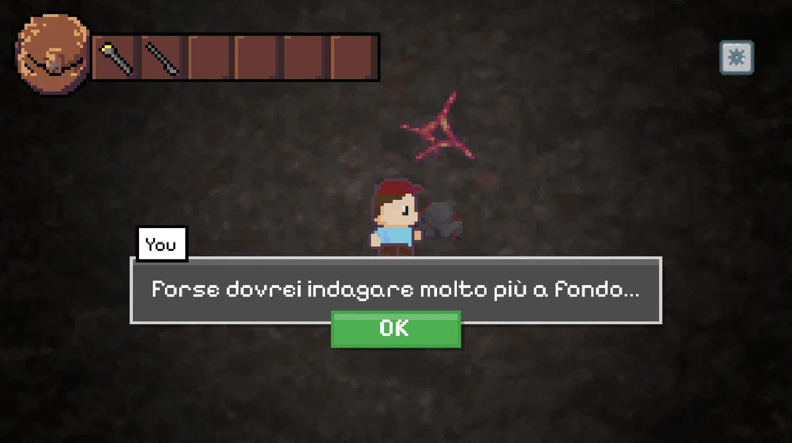
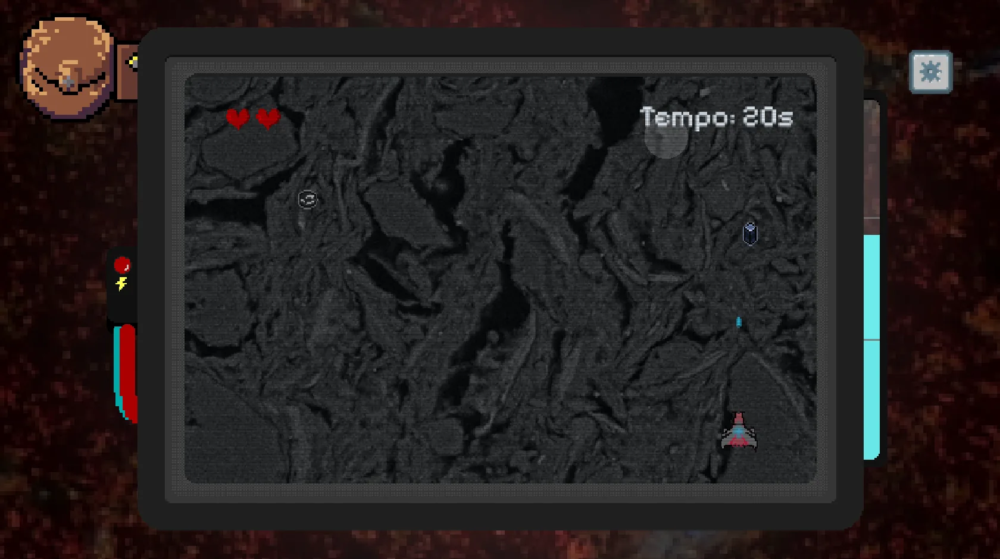
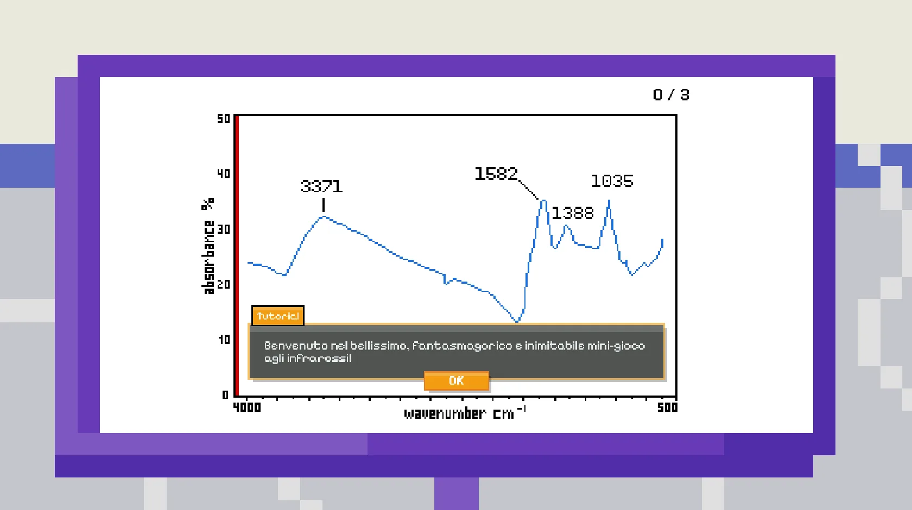

<p align="center">
  
</p>

# Pot Tales

Un'avventura 2D per browser desktop che rende esplorabile la ricerca archeometrica
sui residui conservati nelle ceramiche antiche. Interfaccia in italiano e inglese.

Il progetto è finanziato dall'Università di Padova nell'ambito di **Progetti
Innovativi 2025**. Il nome originario del repository, `progetti_innovativi`,
deriva da questo bando. Il titolo testuale è Pot Tales; l'artwork originale
del logo conserva la scritta «Pot Tale».

## Il contesto della ricerca

I depositi neri all'interno dei contenitori ceramici sono capsule del tempo:
il loro studio restituisce informazioni sulle attività delle comunità antiche
e sugli ambienti in cui vivevano. L'indagine combina analisi petrografiche,
mineralogiche, chimiche e spettroscopiche con microscopia elettronica e datazione.

Pot Tales racconta questi metodi attraverso un laboratorio e un percorso nei
depositi: si impara muovendosi, osservando e risolvendo le sfide del gioco.

## L'esperienza di gioco

Il percorso attraversa tre tappe: spettroscopia infrarossa (IR), microanalisi
EDS e microscopia SEM, poi interpretazione dei reperti. Narrazione, minigiochi
e quiz collegano ciò che si vede alle domande della ricerca.

<p align="center">
  
</p>
<p align="center">
  
</p>
<p align="center">
  
</p>

Il gioco richiede un computer e non richiede installazione nel browser. La
telemetria analitica facoltativa si attiva soltanto dopo una scelta esplicita.

## Dove è stato usato e stato attuale

È stato presentato al congresso SIMP (15-16 settembre 2026) e a Science4All
UniPD (26-27 settembre 2026). Il servizio su pot-tales.it è stato online
dall'11 al 27 settembre 2026; il servizio è **offline e riattivabile** per nuovi eventi.

## Il team

Dodici partecipanti, tra archeologia, informatica e audiovisivo:
F. M. Valente · C. D. Baeza Vega · D. Favale · L. Mocchiutti · I. Malliota ·
I. Garcia Trivès · T. T. Kahveci · R. Buso · A. Cipriani · F. Marcon ·
I. Rossi · L. Soligo.

## Provarlo in locale

Servono Git, Docker con Compose e `make`. Da un terminale nella directory del progetto:

```bash
cp .env.example .env
make dev-up
```

Aprire `http://localhost`. Su Windows usare Git Bash o WSL con Docker Desktop.
Per limitare il download iniziale della cronologia degli asset:

```bash
git clone --filter=blob:none https://github.com/subnetMusk/pot-tales.git
```

## Documentazione tecnica

Il gioco usa Phaser 3, TypeScript e Vite; il backend Go conserva lo stato su
MongoDB e Redis. Il deploy usa Docker Swarm e Traefik, con osservabilità Elastic,
sorveglianza esterna, backup e procedure di recupero.

Il [manuale](docs/README.md) collega architettura, sviluppo e gestione del servizio.
`make help` elenca i comandi disponibili.

## Licenza e crediti

Codice e documentazione tecnica: [MIT](LICENSE).
Asset del gioco e screenshot: [licenza separata](ASSETS-LICENSE.md),
tutti i diritti riservati ai rispettivi autori. Le dipendenze e i materiali
di terzi mantengono le proprie licenze.
