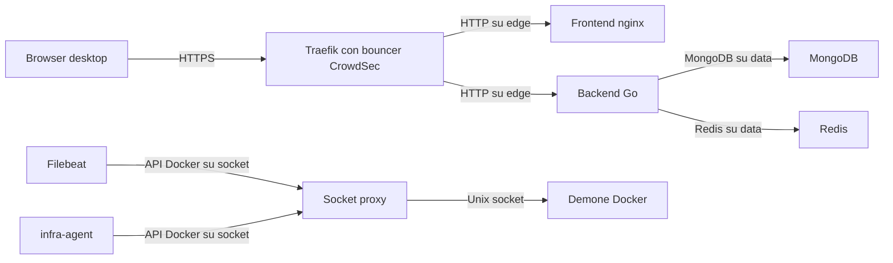
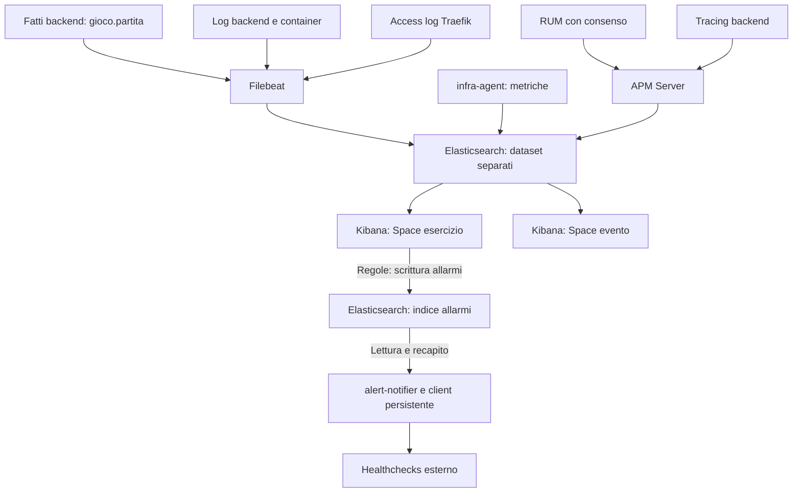

# Architettura

Componenti, confini di rete, stato di gioco e flussi dei dati. L'avvio locale
è in [Sviluppo](SVILUPPO.md); le procedure operative sono in
[Esercizio](ESERCIZIO.md).

## Componenti

| Componente | Ruolo |
|---|---|
| Frontend | landing page, consenso, informativa e applicazione Phaser, compilati con Vite e serviti da nginx |
| Backend | servizio Go: ciclo di vita della sessione, stato di gioco lato server, ingestione degli eventi |
| MongoDB | persistenza di sessioni e stato di gioco |
| Redis | cache di sessione e contatori delle quote |
| Traefik | unico ingresso, instradamento e difese di bordo |
| Stack Elastic | log, metriche e telemetria applicativa |
| Sandbox | gemello del frontend per prototipare, escluso dal monitoraggio |

La home del frontend è su `/`. Il gioco
inizia su `/play`, dopo la scelta privacy, mentre l'informativa completa è su
`/privacy`. Il percorso `/info` reindirizza alla home.

### Mappa dei componenti in produzione

Vista delle dipendenze applicative e dell'accesso all'API Docker. Le etichette
indicano protocollo e rete; il routing Traefik usa file dichiarativi.

## Reti

| Rete | Chi ci sta |
|---|---|
| `edge` (produzione) | Traefik, frontend, backend e servizi con un percorso pubblico |
| `data` (produzione) | backend, MongoDB e Redis; **senza uscita internet** |
| `socket` (produzione) | socket-proxy, Filebeat e infra-agent |
| `elastic` (produzione) | osservabilità, backend e client persistente; accesso al registro dei pacchetti |
| `proxy_net`, `frontend_net` (sviluppo) | backend e servizi tecnici sulla prima, frontend e sandbox sulla seconda; Traefik su entrambe |
| `internal_net` (sviluppo) | persistenza e osservabilità; **senza uscita internet** |
| `kibana_net` (sviluppo) | uscita internet di Kibana |

In produzione **Traefik è l'unico servizio che pubblica porte**, e lo fa in `mode: host`
e non `ingress`. Il routing mesh di Swarm applica SNAT e sostituirebbe l'indirizzo del
client con quello della rete interna: quote per indirizzo e rilevamento vedrebbero tutto
il traffico come proveniente da un unico host.

## Frontend

Phaser 3 con TypeScript, compilato da Vite.

| Directory | Contenuto |
|---|---|
| `src/scenes/` | scene di gioco |
| `src/items/` | oggetti ed entità |
| `src/network/` | sessione API e telemetria |
| `src/components/` | componenti di interfaccia riutilizzabili |
| `public/assets/` | sprite, audio, traduzioni |

Gli schemi in `comms/frontend/` definiscono i contratti verso il backend, validati con
Zod lato client.

**Politiche di cache in produzione**: gli artefatti con un'impronta nel
nome sono `immutable` per un anno, gli asset di gioco hanno nomi stabili e quindi durata
di un'ora, il documento di ingresso non va mai in cache perché dichiara quali artefatti
caricare.

## Backend

Go con Gorilla Mux, driver MongoDB e Redis, agente APM Elastic.

### Validazione come whitelist

`server/middleware/validator.go` carica gli schemi JSON da `comms/server/public/` e
valida ogni corpo di richiesta contro lo schema corrispondente. **Una rotta senza schema
non è raggiungibile**. Gli schemi sono dentro
l'immagine, non montati: il processo termina all'avvio se non li trova.

### Superficie HTTP

| Metodo | Rotta | Auth | Quota | Descrizione |
|---|---|---|---|---|
| POST | `/auth/session` | no | dedicata | Crea sessione (cookie `session_token`), con prova di lavoro |
| GET | `/auth/validate` | sì | 600 | Verifica sessione |
| GET | `/game/position` | sì | 1200 | Posizione, scena corrente e checkpoint raggiunti |
| POST | `/game/ping` | sì | 1200 | Ping di gioco, salva posizione e rinnova attività |
| POST | `/game/checkpoint` | sì | 1200 | Registra un traguardo raggiunto |
| POST | `/game/reset` | sì | 1200 | Azzera i progressi della sessione |
| GET | `/health` | no | 0 | Stato di server, Mongo e Redis |

La quota è per sessione e non per indirizzo, sulla finestra di
`SESSION_QUOTA_WINDOW_MIN` minuti (10 per default): un indirizzo pubblico è condiviso
da tutti gli utenti dietro lo stesso NAT, quindi un limite per indirizzo
penalizzerebbe utenti estranei a chi lo supera. Superata la quota la risposta è
`429` con `Retry-After`.

L'autenticazione usa session token (cookie, cache Redis e Mongo).

### Stato di gioco

Il backend conserva posizione, scena e checkpoint ricevuti dal client dopo
autenticazione, schema e quota. Il ping arriva ogni 7 secondi mediante un timer
del browser indipendente dalle scene: prosegue mentre la scena principale è
in pausa per un minigioco. Alla chiusura della scena il timer si ferma e le
risposte ancora in volo non modificano la scena successiva.

Non ci sono controlli di velocità o espulsioni per ritardo: il gioco include
spostamenti a copione e cambi di stanza. La posizione è un dato di ripresa
dichiarato dal client, non una prova anti-cheat.

Le coordinate compaiono solo dopo il primo ping. Gli zeri iniziali non sono
una posizione salvata: prima di quel ping il client usa il punto di ingresso.

### Scritture confermate

Sessioni e stato di gioco usano write concern `j:true`: MongoDB conferma la
scrittura dopo il journal su disco. Il journal consente il recupero delle
scritture confermate dopo un arresto del processo; non protegge dalla perdita
del disco o della macchina. Le copie dei dati sono descritte nel
[provisioning](../provisioning/README.md#copia-di-sicurezza).

### Ritenzione

Un indice TTL su `created_at` cancella i documenti dopo `DATA_RETENTION_DAYS`. È distinta
dalla validità della sessione, che è dell'ordine dei minuti.

## Osservabilità

Elasticsearch, Kibana, Fleet, APM e Filebeat girano su un nodo singolo, senza repliche.
Una replica resterebbe non allocata e manterrebbe il cluster in stato giallo.
La perdita del nodo comporta la perdita degli indici: i dati da conservare vanno esportati.

### Flusso dei dati di osservabilità

Kibana interroga Elasticsearch e vi scrive gli allarmi delle regole.

Lo Space evento legge soltanto `gioco.partita`; quello di esercizio include
anche i dataset tecnici. I battiti host verso Healthchecks sono indipendenti
dal percorso delle regole Kibana.

### Le tre sorgenti

| Sorgente | Cosa contiene |
|---|---|
| Access log di Traefik | richieste, percorsi, user agent, codici di stato |
| APM RUM | caricamenti pagina, tempi di risorsa, errori JavaScript, chiamate HTTP |
| Log applicativi | tracce, latenza, eventi strutturati del backend |

### Dataset

| Dataset | Origine | Chi lo legge |
|---|---|---|
| `traefik.access` | access log del bordo, senza IP né credenziali | vista di esercizio |
| `backend.api` | log del backend | vista di esercizio |
| `gioco.partita` | fatti di partita emessi dal backend | **anche** la vista divulgativa |

Con licenza basic **la sicurezza a livello di documento non esiste**: non c'è modo di
concedere un sottoinsieme di documenti dentro un indice condiviso. La separazione in
indici distinti è l'unico meccanismo disponibile per delimitare ciò che viene condiviso,
e Filebeat instrada su `event.dataset`.

- I fatti di partita usano un identificativo derivato con sale, senza esportare il token
  del cookie. L'identificativo consente di contare e raggruppare gli eventi della sessione.
- Il dispositivo compare come classe, senza user agent integrale.
- Il backend emette i fatti didattici. Il RUM è una sorgente tecnica separata e richiede consenso.

### Fatti di partita

Emessi dal backend nei punti in cui lo stato cambia, non sincronizzando i documenti di
MongoDB: Mongo resta la fonte autorevole dello stato corrente, Elasticsearch riceve i
fatti nel tempo.

| Evento | Origine |
|---|---|
| `sessione_iniziata` | creazione sessione |
| `scena_iniziata` | ping, solo sulla transizione di scena |
| `checkpoint_raggiunto` | endpoint dei traguardi |
| `partita_azzerata` | reset |
| `sessione_conclusa` | chiusura differita o completamento |
| `partita_avviata` | primo checkpoint `game_started`, **anche senza consenso** |

Tutti i fatti richiedono il consenso analitico tranne `partita_avviata`, il conteggio
anonimo dell'affluenza. Può farne a meno perché porta soltanto azione e orario: nessun
`partita.id`, che lo collegherebbe agli altri fatti della stessa partita, nessuna
classe di dispositivo né altri dettagli. È emesso una sola volta per sessione, con la
stessa idempotenza del checkpoint da cui nasce.

La durata (`partita.durata_ms`) va dalla creazione all'ultimo ping ricevuto.
Stage 1, 2 e 3 inviano il ping ogni 7 secondi, anche durante i minigiochi.
Una scheda in background può subire il throttling del browser: la durata non
è una misura esatta dell'attenzione del giocatore. La chiusura per inattività
usa 15 minuti per default, distinti dal TTL della sessione.

Il click su **Play** apre sempre una nuova partita: se il browser ha già una sessione ne
azzera lo stato (`partita_azzerata`), poi crea la sessione prima di entrare in Stage 1 e
registra subito il checkpoint `game_started`. Questo primo traguardo estende il TTL
ridotto delle sessioni appena create e separa nelle dashboard l'avvio effettivo dal
completamento di Stage 1 (`stage1_complete`). **Continue** riprende invece la sessione e
lo stato esistenti. Una guardia condivisa fra i due pulsanti ignora il doppio click e
impedisce che Play azzeri una partita appena ripresa.

**Continue** riparte dalla scena dell'ultimo ping. Stage 1 riparte dall'inizio: fino al suo
completamento non c'è progresso salvato. Stage 2 ripristina sonda, laser, torrette e livello
dello Shooter; Stage 3 i quiz risolti, e con tutti e tre risolti apre subito la porta, perché
recap e porta partono solo dalla risposta corretta al terzo quiz.

Per il riuso delle scene, lo stato e la rimozione dei listener consultare
[Manutenzione delle scene](SVILUPPO.md#manutenzione-delle-scene).

Il data stream contiene **fatti**, non una riga per partita. Con il consenso un singolo
click su **Play** produce esattamente tre fatti iniziali: una `sessione_iniziata`, un
`checkpoint_raggiunto` con checkpoint `game_started` e una `partita_avviata`; senza,
soltanto la `partita_avviata`. Se esisteva una sessione, li precede la
`partita_azzerata` di quella precedente. La progressione aggiunge poi un
fatto per ciascun checkpoint distinto, cambio scena e conclusione. I contatori
“partite” filtrano gli eventi unici del ciclo di vita e crescono di una sola unità per
partita; il conteggio grezzo dei documenti misura invece il volume degli eventi. Il
checkpoint finale `stage3_complete` chiude immediatamente la partita con motivo
`completata`, così la spazzata non la riclassifica come abbandono per inattività.

Una spazzata periodica rivendica le partite inattive ed emette la conclusione
con durata e scena finale. La rivendicazione è atomica,
quindi le repliche del backend non emettono la stessa conclusione due volte.

### Due Space, due platee

| Space | Indici | Contenuto |
|---|---|---|
| Esercizio | log, metriche, tracce, allarmi e fatti di gioco | salute del servizio, risorse, contenimento, imbuto |
| Andamento evento | solo `gioco.partita` | affluenza e comportamento, nessuno stato macchina |

I ruoli in sola lettura sono definiti via Terraform. Le dashboard si modificano in
Kibana, si esportano in NDJSON e si reimportano tramite Terraform.
Discover resta entro lo stesso confine: nello Space evento rende consultabili i soli
fatti pseudonimizzati di `gioco.partita`, senza concedere log tecnici, metriche o tracce.

### Sorveglianza esterna

Un servizio esterno riceve battiti e allarmi e segnala l'assenza dei battiti
quando la macchina è irraggiungibile.

Le notifiche del servizio sono legate alla **transizione di stato**: un secondo segnale
di guasto mentre la destinazione è già in guasto non produce nulla. Per questo le classi
sono separate su check distinti, e ciascuna transita per conto proprio.

Otto check: due battiti (servizio e recapito degli allarmi), cinque relay su
segnale esplicito e un check a calendario per la copia notturna. Le cadenze
sono definite nel [provisioning](../provisioning/README.md#gli-otto-check-da-creare-sul-pannello).

## Sicurezza

Traefik con limite di frequenza, tetto sulle richieste in volo, tetto sul corpo,
interruttore per staccare un backend in sofferenza, intestazioni di sicurezza e politica
sui contenuti. CrowdSec come bouncer.

Le soglie per indirizzo tengono conto delle postazioni dietro lo stesso NAT.
Le decisioni locali di CrowdSec sono disattivate per evitare blocchi dell'intera sala.

Il controllo applicativo dei backend è distinto dall'healthcheck del container: il
secondo osserva il processo, il primo la risposta. Un servizio vivo che risponde in modo
non valido resta nel bilanciamento senza il primo.

### Host, accessi e CI

Il [provisioning](../provisioning/README.md) prepara firewall, journald, backup
e unità systemd. Il socket proxy limita le API Docker raggiungibili dai servizi;
MongoDB e Redis restano sulla rete interna. Le dashboard richiedono credenziali
distinte e ruoli in sola lettura. I segreti si generano al deploy, secondo la
[guida](../secrets/README.md), e non sono versionati.

La CI verifica codice, configurazioni, superficie HTTP e persistenza, ricerca
credenziali con gitleaks e dipendenze vulnerabili con Trivy. Le action e le
immagini degli strumenti sono fissate a revisioni immutabili.

## Dati e privacy

Il consenso precede RUM e fatti analitici di partita, salvo il conteggio anonimo
degli avvii, che non porta identificativo né dispositivo. Gli identificativi
analitici sono derivati con un sale; le classi di dispositivo sostituiscono
gli user agent nei fatti condivisi. Il backend tronca gli IP secondo la sua
configurazione; Filebeat rimuove IP, cookie e Authorization dalla copia
degli access log inviata a Elasticsearch.

La ritenzione predefinita è 30 giorni per i dati applicativi e analitici.
I log di bordo locali seguono la rotazione dell'host. Backup ed export vanno
protetti e rimossi secondo la durata di conservazione definita per l'evento.
Alla chiusura si separano gli aggregati da archiviare dai dati individuali;
un nuovo esercizio parte da dati vuoti e aggiorna contatti e informativa.

## Fragilità note

**Race sui certificati all'avvio in sviluppo.** In `docker-compose.monitoring.yml` `es01`
dipende da `setup` con `condition: service_started` e non `service_healthy`, perché
`setup` attende a sua volta che ES risponda per impostare la password di `kibana_system`:
usare `service_completed_successfully` produrrebbe un deadlock. Può verificarsi una
race in cui `es01` parte prima che i certificati siano scritti. In produzione il problema
non si pone: su Swarm non esiste `depends_on` e i servizi ripartono finché la dipendenza
non è pronta.

**Filebeat parte prima della propria utenza.** Scrive come `filebeat_writer`, che
Terraform crea al bootstrap con i privilegi per scrivere i log e gestirne template e
ciclo di vita, e nient'altro. Fino a quel momento riceve un 401 e ritenta, e dopo il
primo avvio il servizio risulta non sano per qualche minuto: lo stack converge da solo,
come per gli agenti Fleet.

**I config e i secret di Swarm sono immutabili.** Modificare un file lasciando invariato
il nome non aggiorna nulla: il demone rifiuta, il deploy esce con errore e i servizi
restano montati sul contenuto precedente. Il nome porta l'impronta del contenuto proprio
per questo, e `--prune` non rimuove i config e i secret sostituiti, che vanno rimossi a
parte.

**Segreti.** In sviluppo `.env` contiene password in chiaro. In produzione i valori sono
generati sulla macchina da `provisioning/bin/generate-secrets.sh` e non entrano mai nel
repository. Arrivano ai servizi come Docker secret, trasmessi su mTLS, cifrati nel Raft
log e montati in un filesystem in memoria sotto `/run/secrets`. Gli entrypoint che
richiedono variabili d'ambiente li leggono nel solo processo applicativo; i valori
non compaiono nella specifica Swarm del servizio. Sul disco della macchina restano come file
con permessi 0400 in una directory 0700.

Le dashboard hanno un vincolo aggiuntivo: Traefik usa hash bcrypt, mentre
Elasticsearch deve ricevere la password per creare l'utente. La fonte
`dashboard_users.tfvars.json`, anch'essa `0400`, conserva quindi le due mappe
solo per il contenitore Terraform effimero. Il bootstrap la richiede
esplicitamente, così un ripristino incompleto non può dichiarare pronte
dashboard in realtà irraggiungibili.

La procedura di rotazione, compresi i valori da aggiornare prima nel servizio, è in
[`ESERCIZIO.md`](ESERCIZIO.md#cambiare-un-secret). Cifrare i file, per esempio con SOPS,
servirebbe a condividere il `.env` di sviluppo. In produzione sposterebbe il problema sulla
chiave che li decifra, che l'avvio non presidiato dovrebbe comunque trovare sulla macchina.

### Consegna dei log e tracing

Filebeat consegna almeno una volta. I fingerprint di `gioco.partita` e
`traefik.access` fissano `@metadata._id`: la rilettura nello stesso indice non
crea una nuova riga. Il rollover cambia indice di destinazione, quindi questa
misura non garantisce deduplicazione fra indici diversi; il registry persistente
resta necessario.

APM è registrato sul router dopo il matching e prima della validazione: il nome
della transazione usa il template della rotta. `restart` rende il campionamento
backend indipendente dal RUM al 20%, conservando il collegamento tra tracce.
Il client `surveillance-client` nella rete Elastic è riusato dai timer host con
`docker exec`, senza creare un container per ogni battito.

## Riferimenti

- [`provisioning/README.md`](../provisioning/README.md): preparazione dell'host, sorveglianza, dati
- [`terraform/README.md`](../terraform/README.md): osservabilità come codice, stato Terraform
- [`terraform/elk/README.md`](../terraform/elk/README.md): Space, ruoli, utenze, dashboard
- [`secrets/README.md`](../secrets/README.md): secret dello stack
- [`deploy/stack.yml`](../deploy/stack.yml): definizione dello stack di produzione
